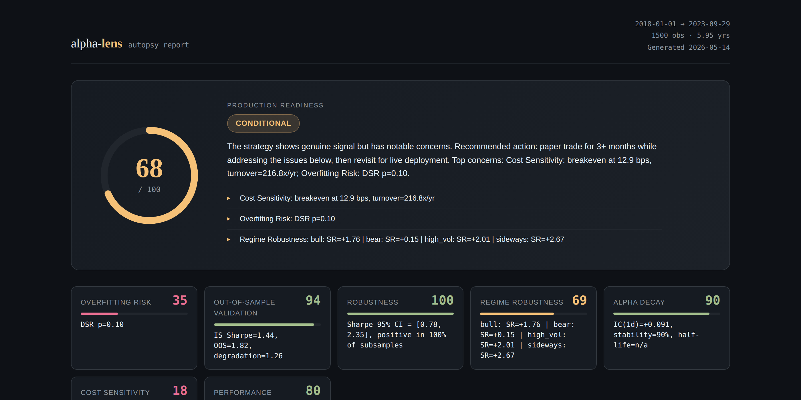
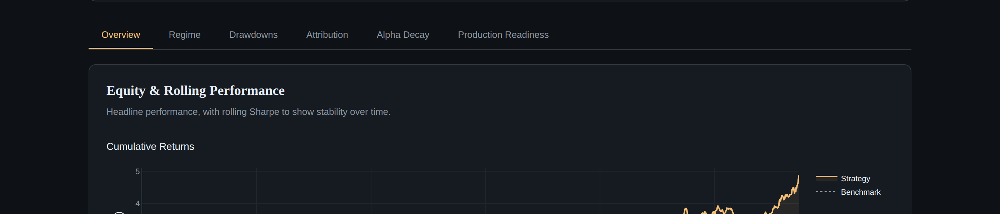
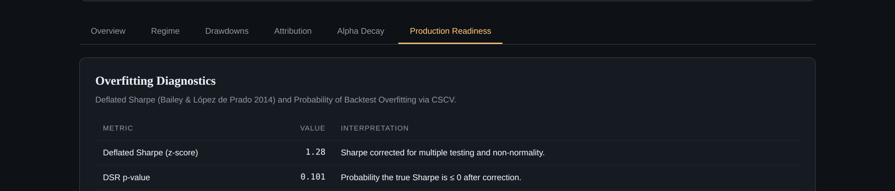
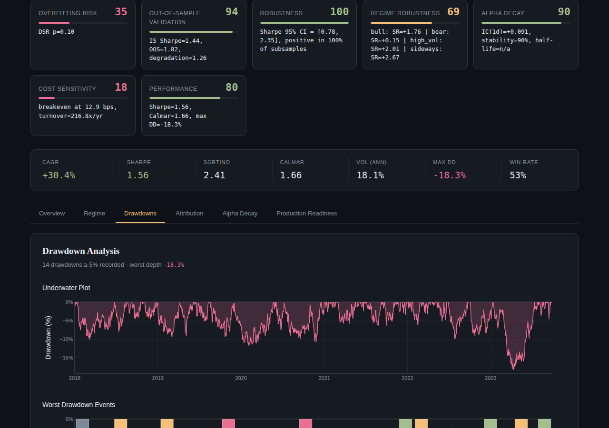

# alpha-lens

> **The autopsy your backtest deserves before you deploy.**
>
> A Python library for post-mortem analysis and production-readiness validation of quantitative trading strategies.

<p align="center">
  
  <a href="https://github.com/ellatso/alpha-lens/actions"></a>
</p>

<p align="center">
  <a href="#"></a>
  <a href="#"></a>
  <a href="#"></a>
  <a href="#"></a>
</p>

---

## Why alpha-lens exists

A 3.0 Sharpe ratio on a five-year backtest looks compelling. It is also the
single most common artifact of overfitting in quantitative research. Existing
tools like `alphalens` and Qlib report **what the backtest shows**. They do
not answer the question that actually matters before a strategy goes live:

> **Will this Sharpe ratio survive contact with reality?**

`alpha-lens` is built around that question. Given the daily returns of a
strategy &mdash; and, optionally, factors, benchmarks, positions, and the
other strategies you tried before this one &mdash; it produces a single
**Production Readiness Score** from 0 to 100 with a `READY` /
`CONDITIONAL` / `NOT_READY` / `REJECT` verdict.

The score aggregates seven components:

| Component | What it measures | Method |
|-----------|------------------|--------|
| **Overfitting Risk** | Probability the Sharpe is selection-bias luck | Deflated Sharpe (Bailey & López de Prado 2014), PBO via CSCV, Minimum Backtest Length |
| **OOS Validation** | Does the strategy work on data it was not built on? | 70/30 chronological split + 5-window walk-forward |
| **Robustness** | Is the result fragile? | 1000-sample bootstrap CI on Sharpe + 4-subsample stability |
| **Regime Robustness** | Does it work in bull, bear, and high-vol regimes? | Rule-based or HMM regime detection, per-regime Sharpe |
| **Alpha Decay** | How fast does the signal die? | Rank IC across forward horizons, exponential half-life fit |
| **Cost Sensitivity** | What does it take to kill the strategy? | Bisection on transaction cost, break-even bps |
| **Performance** | Raw return profile | Sharpe, Sortino, Calmar, drawdown statistics |

The weights are calibrated so the score rewards *evidence the strategy will
work in production*, not *raw backtest performance*. A 3.0-Sharpe backtest
with a 70% PBO and 80% OOS degradation scores in the 20s. A 1.2-Sharpe
strategy with statistically significant Deflated Sharpe, low PBO, stable
walk-forward, and a 50bps cost margin scores in the 80s.

---

## Quick start

```bash
pip install alpha-lens
```

```python
import pandas as pd
from alpha_lens import autopsy

# Daily returns of your strategy.
returns = pd.Series(...)

report = autopsy(returns)
print(report.readiness.verdict)         # ReadinessVerdict.CONDITIONAL
print(report.readiness.overall_score)   # 68.3
report.save("autopsy.html")             # Standalone interactive HTML.
```

That's it. The report opens in any browser, works offline (Plotly.js is
inlined), and contains six interactive tabs of diagnostics.

For a richer autopsy, pass everything you have:

```python
report = autopsy(
    returns,
    benchmark_returns=spy_returns,    # Enables CAPM-style attribution.
    factors=ff3_factors,              # Multi-factor regression.
    factor_values=my_signal,          # IC and alpha decay analysis.
    positions=daily_weights,          # Accurate cost analysis.
    strategy_variants=other_variants, # PBO via CSCV.
    n_trials_assumed=500,             # How many things did you actually try?
)
```

---

## Inside the report

The HTML report has six tabs. Each is designed to be read in &lt;30 seconds.

### Overview &mdash; the headline
<p align="center">
  
</p>

Equity curve, rolling 63-day Sharpe with regime overlay, and a calendar
heatmap of monthly returns. The first thing a PM looks at.

### Production Readiness &mdash; the differentiator
<p align="center">
  
</p>

Where `alpha-lens` earns its name. Every diagnostic that goes into the
score, shown with the value, the threshold, and a plain-English
interpretation. Deflated Sharpe, PBO, minimum backtest length, walk-forward
Sharpes, bootstrap CI, cost-breakeven sweep &mdash; the whole audit trail.

### Regime, Drawdowns, Attribution, Decay
<p align="center">
  
</p>

Four drill-down tabs. The drawdown tab tags each peak-to-trough event with
the dominant regime that caused it (weighted by loss magnitude, not just
frequency). The decay tab fits an exponential half-life to the IC term
structure. Attribution runs an OLS regression with t-stats and reports an
uniqueness score.

> 📊 **Live demo:** open [`docs/demo/sample_report.html`](docs/demo/sample_report.html) in any browser to see the full interactive report.

---

## How is this different from `alphalens` and Qlib?

| | `alphalens` | Qlib | **`alpha-lens`** |
|---|---|---|---|
| Factor IC + decay | ✅ | ✅ | ✅ |
| Returns by quantile | ✅ | ✅ | (not the focus) |
| Turnover and cost analysis | partial | ✅ | ✅ + bisection for break-even |
| Regime decomposition | ❌ | ❌ | ✅ rule-based + HMM |
| Deflated Sharpe Ratio | ❌ | ❌ | ✅ |
| PBO via CSCV | ❌ | ❌ | ✅ |
| Minimum Backtest Length | ❌ | ❌ | ✅ |
| Walk-forward consistency | ❌ | partial | ✅ |
| Bootstrap Sharpe CI | ❌ | ❌ | ✅ |
| **Production Readiness Score** | ❌ | ❌ | ✅ |
| **Standalone interactive HTML report** | partial | ❌ | ✅ &lt;6MB, offline-capable |

`alpha-lens` is not a replacement for `alphalens`. It complements it:
`alphalens` is best when you are *researching* a factor; `alpha-lens` is
best when you are *deciding whether to trade it*.

---

## Methodology

The statistical machinery is grounded in published research:

- **Deflated Sharpe Ratio** &mdash; Bailey, D. and López de Prado, M. (2014).
  *The Deflated Sharpe Ratio: Correcting for Selection Bias, Backtest
  Overfitting, and Non-Normality.* Journal of Portfolio Management.
- **Probability of Backtest Overfitting** &mdash; Bailey, D., Borwein, J.,
  López de Prado, M., and Zhu, Q. (2017). *The Probability of Backtest
  Overfitting.* Journal of Computational Finance.
- **Minimum Backtest Length** &mdash; Bailey, D. and López de Prado, M.
  (2014). *The Sharpe ratio efficient frontier.* Journal of Risk.
- **Information Coefficient** &mdash; Grinold, R. and Kahn, R. (1999).
  *Active Portfolio Management.* (Rank-IC via Spearman.)
- **Walk-forward analysis** &mdash; common in quant practice; see Pardo (2008).

Implementation notes are in [`docs/concepts.md`](docs/concepts.md).

---

## Examples

The [`examples/`](examples/) directory contains:

- `quickstart.py` &mdash; 20-line autopsy on a synthetic strategy.
- `momentum_autopsy.py` &mdash; full cross-sectional momentum L/S autopsy with
  benchmark, factors, factor values, and positions.
- `compare_real_vs_lucky.py` &mdash; the canonical "best-of-N noise"
  experiment. Shows how PBO and Deflated Sharpe expose lucky backtests.

Run any of them:

```bash
python examples/quickstart.py
open out/quickstart.html
```

---

## Installation

```bash
# Core library.
pip install alpha-lens

# With optional HMM-based regime detection.
pip install "alpha-lens[hmm]"

# Development install.
git clone https://github.com/alpha-lens/alpha-lens
cd alpha-lens
pip install -e ".[dev]"
pytest
```

Python 3.10+. Core deps: `numpy`, `pandas`, `scipy`, `scikit-learn`,
`plotly`, `statsmodels`, `pydantic`.

---

## Project status

Version `0.1.0` &mdash; usable, tested, and documented. 85 tests covering
every analysis module. The API is not yet frozen; expect refinements in
the scoring weights and report layout in the next few releases.

**Roadmap:**
- Capacity / market-impact estimation (currently we report turnover only)
- Optional LLM-based interpretation layer (translate the scorecard into prose)
- Built-in adapters for Qlib and `vectorbt` output formats
- Stationary bootstrap option for time-series CI

---

## License

MIT. See [`LICENSE`](LICENSE).

## Acknowledgements

The Production Readiness Score is heavily influenced by Marcos López de
Prado's work on backtest overfitting. Any errors or oversimplifications
in the implementation are mine.
